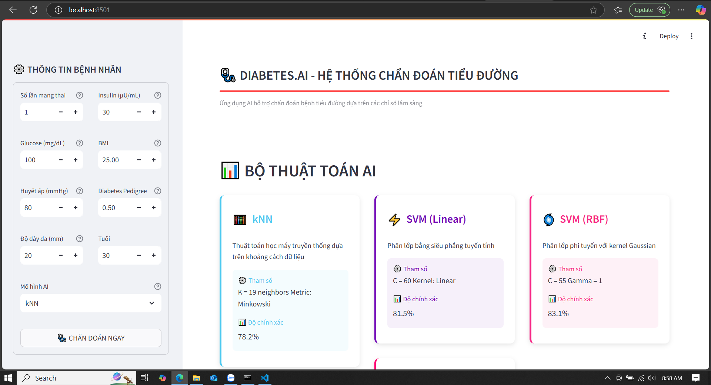

# Dự đoán Bệnh Tiểu Đường bằng Các Mô Hình Machine Learning và Deep Learning  

## Giới thiệu  
Dự án này nhằm xây dựng và so sánh các mô hình Machine Learning và Deep Learning trong việc dự đoán bệnh tiểu đường dựa trên bộ dữ liệu **Pima Indians Diabetes Dataset**. Mục tiêu chính là đánh giá độ chính xác của từng mô hình và triển khai một giao diện đơn giản để người dùng có thể nhập thông tin sức khỏe và nhận kết quả dự đoán.  

## Mô hình được triển khai  
Dự án bao gồm 5 mô hình:  
1. **k-Nearest Neighbors (kNN)**  
2. **Support Vector Machine (SVM) - Kernel tuyến tính**  
3. **Support Vector Machine (SVM) - Kernel RBF (Gaussian)**  
4. **Hồi quy Logistic (Logistic Regression)**  
5. **Mạng Neural Deep Learning (DNN)** với hơn 5 tầng ẩn  

## Bộ dữ liệu  
- **Nguồn:** [Pima Indians Diabetes Database](https://www.kaggle.com/datasets/uciml/pima-indians-diabetes-database)  
- **Mô tả:** Gồm 768 mẫu dữ liệu với 8 đặc trưng sinh học như:  
  - Số lần mang thai  
  - Nồng độ glucose  
  - Huyết áp  
  - Độ dày da  
  - Insulin  
  - BMI  
  - Chỉ số di truyền tiểu đường  
  - Tuổi  
- **Mục tiêu:** Dự đoán bệnh tiểu đường dựa trên các đặc trưng này.  

## Giao diện ứng dụng  
Dưới đây là giao diện chính của ứng dụng dự đoán bệnh tiểu đường:  

